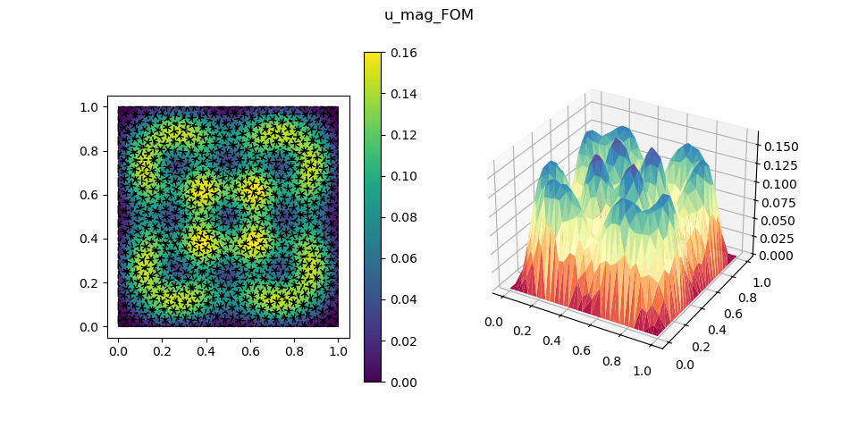
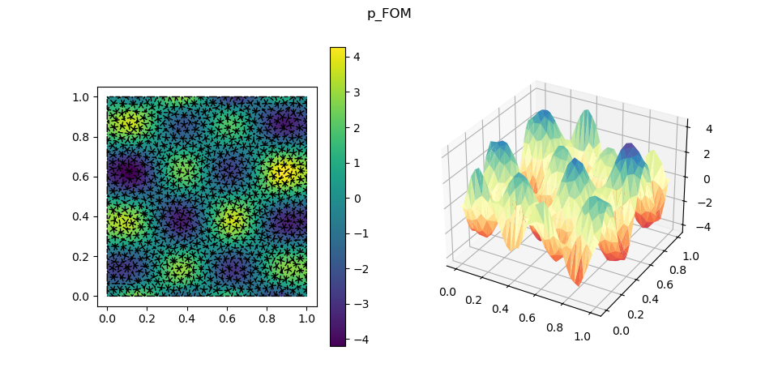

# Comparative Study of Reduced and Surrogate Models for Parametric Navier–Stokes

This repository contains a comparative study of reduced and surrogate modelling strategies for the parametric steady incompressible Navier–Stokes equations. The goal is to compare projection-based model reduction and neural surrogate approaches in terms of accuracy, online computational cost, speedup and practical usability.

The reference problem is defined on:

$$
\Omega = [0,1]^2,
\qquad
\mu = (\mu_0,\mu_1) \in [1,10]\times[1,3].
$$

Find the velocity field \(u\) and the pressure \(p\) such that:

$$
\begin{cases}
-\mu_0 \Delta u + (u \cdot \nabla)u + \nabla p = f(x,y;\mu_1) & \text{in } \Omega,\\
\nabla \cdot u = 0 & \text{in } \Omega,\\
u = 0 & \text{on } \partial \Omega,\\
p(0,0)=0.
\end{cases}
$$

with homogeneous Dirichlet boundary conditions for the velocity and a pressure constraint used to fix the additive constant.

The example below shows the numerical solution generated with the finite element method (FEM) as FOM. The left figure reports the velocity magnitude, while the right figure reports the pressure field.

| Velocity magnitude | Pressure |
|---|---|
|  |  |

**Report:** [Read the full PDF report](Finite_Element__POD_Galerkin__PODNN_and_PINN_Approaches_for_a_Parametric_Steady_Navier__Stokes_Problem.pdf)

The corresponding numerical solutions are also exported in `.vtu` format and can be opened with external visualization software such as ParaView. For the FOM case, the exported files are stored in:

```text
Export/Solution/FOM/u_x_FOM.vtu
Export/Solution/FOM/u_y_FOM.vtu
Export/Solution/FOM/p_FOM.vtu
```

The comparison includes:

- **FOM**: full-order finite element model used as reference solution;
- **POD-Galerkin**: intrusive reduced-order model obtained by projecting the FOM operators onto a POD basis;
- **PODNN**: non-intrusive neural surrogate where a neural network predicts the POD coefficients from the parameters;
- **PINN**: physics-informed neural network.

---

## Code structure

```text
Software/
├── main.py                 # Offline pipeline for model construction, training and comparison
├── PODGalerkin_online.py   # Online-only POD-Galerkin evaluation after main.py
├── PODNN_online.py         # Online-only PODNN evaluation after main.py
├── PINN_online.py          # Online-only PINN evaluation after main.py
├── PINN_tuning.py          # Physics-only lambda tuning for the PINN loss terms
├── Solver.py               # FOM solver and Newton procedure
├── Assembler.py            # Assembly utilities for operators, RHS and strong values
├── ROM.py                  # POD-Galerkin, PODNN and metric-evaluation utilities
├── PINN.py                 # PINN architecture, training, saving and loading
├── Discretization.py       # Mesh and domain discretization utilities
├── other_utilities.py      # Export, plotting and helper functions
├── environment_full.yml    # Conda environment specification
└── readme.md
```

The main output folders are generated automatically when needed:

```text
Export/
├── Models/                 # Saved reduced/surrogate models
├── Mesh/                   # Exported mesh files
└── Solution/               # Exported solution files

Results/
├── POD_Galerkin/           # FOM vs POD-Galerkin metrics
├── PODNN/                  # FOM vs PODNN metrics
└── PINN/                   # FOM vs PINN metrics

Plots/                      # Saved plots of reconstructed solutions
```

---

## Running the offline comparison

Create and activate a Python environment of your choice. The repository uses a conda environment export file:

```text
environment_full.yml
```

To recreate the environment from this file, run:

```bash
conda env create -f environment_full.yml
```

Then activate the environment created from the YAML file. The environment name is the one specified inside `environment_full.yml`.

If you only want to update an already existing environment, run:

```bash
conda env update -f environment_full.yml --prune
```

The custom `pypolydim` package **must be installed separately**, as explained in the next section. After the dependencies and `pypolydim` are installed, run:

```bash
python main.py
```

---

## Managing dependencies and Installing `pypolydim`

The file:

```text
environment_full.yml
```

contains the conda environment specification used to run the code. It is more appropriate than a simple `requirements.txt` here because the workflow relies on scientific Python packages, PyTorch and a local wheel installation for `pypolydim`. However, `pypolydim` is not expected to be installed automatically from the YAML file. It should be installed manually from the correct local wheel after the conda environment has been created.

The finite element backend relies on the external `pypolydim` package. This package is not installed from PyPI in the usual way. It must be downloaded from the official distribution page in the version matching:

- the Python version used in the environment, for example Python 3.11;
- the operating system;
- the machine architecture, for example macOS ARM64 or x86_64.

For example, on a macOS ARM64 machine with Python 3.11, the downloaded wheel may have a name similar to:

```text
pypolydim-2.0.12-cp311-cp311-macosx_11_0_arm64.whl
```

After downloading the correct `.whl` file, place it in the `Software/` folder or in another known local folder. Then install it inside the active Python environment with:

```bash
python -m pip install ./pypolydim-2.0.12-cp311-cp311-macosx_11_0_arm64.whl
```

Replace the wheel filename with the one matching your system.

To verify the installation, run:

```bash
python -c "from pypolydim import polydim, gedim; print('pypolydim installed correctly')"
```

If the command prints the confirmation message without errors, the package is correctly installed.

After installing `pypolydim`, the main comparison can be launched with:

```bash
python main.py
```

`main.py` performs the full offline workflow:

1. builds the mesh and FEM discretization;
2. solves an initial FOM problem;
3. generates a training set of parameter values $(\mu_0,\mu_1)$;
4. solves the FOM for the training parameters and builds the snapshot matrices;
5. computes the POD basis;
6. precomputes the reduced quantities needed by POD-Galerkin;
7. trains the PODNN model;
8. trains the PINN model;
9. evaluates the selected methods against the FOM on a testing set;
10. saves the trained/reduced models in `Export/Models/`.

The method to execute is selected in `main.py`:

```python
method = 'all'
```

Available options are:

```python
method = 'PODGalerkin'
method = 'PODNN'
method = 'PINN'
method = 'all'
```

Use `all` to run the complete comparison. 
Use a single method to reduce execution time during debugging.

---

### External-library note

The code depends on `pypolydim`, which provides the FEM-related utilities used by the FOM and by the FEM-style plotting/export routines. Since this is an external compiled package, the wheel must match the local Python version and machine architecture.

During execution, the Python process may occasionally abort without a standard Python traceback, for example:

```text
zsh: abort      python main.py
```

This appears to be related to the underlying library/runtime rather than to a deterministic Python exception. In practice, the same command may fail once and then run correctly when launched again.

If `main.py` terminates with a low-level abort and no Python traceback, rerun:

```bash
python main.py
```

It may be necessary to launch the script more than once before the full pipeline starts correctly.

---

## Saved models

After `main.py` has completed successfully, the following files are generated:

```text
Export/Models/reduced_model.pkl   # POD-Galerkin reduced model
Export/Models/podnn_model.pkl     # PODNN model
Export/Models/pinn_model.pkl      # PINN model
```

These files are required by the online scripts. The online scripts should be launched only after the corresponding model has been generated by `main.py`.

---

## Online evaluation scripts

The online scripts demonstrate the online phase only. They load already trained or reduced models and evaluate them for a new parameter value.

### POD-Galerkin online

```bash
python POD_online.py
```

This script loads:

```text
Export/Models/reduced_model.pkl
```

and solves the reduced POD-Galerkin system for a chosen parameter pair, for example:

```python
mu0 = 1.0
mu1 = 3.0
```

It does not rebuild snapshots, recompute the POD basis or rerun the full offline workflow.

### PODNN online

```bash
python PODNN_online.py
```

This script loads:

```text
Export/Models/podnn_model.pkl
```

and evaluates the trained neural network to predict the POD coefficients. The reconstructed solution is obtained as:

$U_{PODNN}(\mu) = V a_{NN}(\mu)$.

No FOM solve and no POD recomputation are performed.

### PINN online

```bash
python PINN_online.py
```

This script loads:

```text
Export/Models/pinn_model.pkl
```

and evaluates the trained PINN on a regular grid in $[0,1]^2$. The PINN directly approximates:

$(x,y,\mu_0,\mu_1) \mapsto (u_x,u_y,p)$.

Unlike POD-Galerkin and PODNN, the PINN does not use a POD basis.

---

## Metrics and result files

During the offline comparison, each method is evaluated against the FOM on a testing set of parameter values.

The computed quantities include:

- relative error on the global solution vector;
- relative error on $u_x$;
- relative error on $u_y$;
- relative error on velocity magnitude $|u|$;
- relative error on pressure $p$;
- FOM execution time;
- reduced/surrogate model execution time;
- speedup;
- Newton iterations for FOM/POD-Galerkin when applicable;
- model dimension or number of model parameters.

The results are saved as CSV files:

```text
Results/POD_Galerkin/fom_vs_pod_galerkin_metrics.csv
Results/POD_Galerkin/fom_vs_pod_galerkin_summary.csv

Results/PODNN/fom_vs_podnn_metrics.csv
Results/PODNN/fom_vs_podnn_summary.csv

Results/PINN/fom_vs_pinn_metrics.csv
Results/PINN/fom_vs_pinn_summary.csv
```

The `*_metrics.csv` files contain one row per testing parameter.
The `*_summary.csv` files contain mean, max, min and standard deviation for each metric.

---

## Plotting

When `visualize = True` in `main.py`, reconstructed solutions are exported and plotted.

For POD-Galerkin and PODNN, the solution is reconstructed on the FEM degrees of freedom and exported using the same plotting workflow as the FOM.

For PINN, the network can be evaluated either:

- directly on a regular grid, for pure online evaluation;
- on FEM degrees of freedom, when comparison with the FOM or FEM-style plotting is required.

Plots and exported solutions are stored in:

```text
Plots/
Export/Solution/
```

The `.png` files are intended for quick inspection and README visualization. The `.vtu` files contain the exported numerical fields and can be loaded in external visualization tools, for example ParaView, for interactive post-processing.

---

## Typical workflow

```bash
conda env create -f environment_full.yml
conda activate <environment_name>
python -m pip install ./pypolydim-2.0.12-cp311-cp311-macosx_11_0_arm64.whl
python main.py
```
---

## Notes

- `main.py` can be computationally expensive because it generates FOM snapshots and evaluates metrics against fresh FOM solves.
- Dependency reproduction is based on `environment_full.yml`; `pypolydim` must still be installed manually from the appropriate wheel.
- The online scripts are much lighter and demonstrate the online-use phase after model construction.
- PINN performance is sensitive to loss weights, training epochs, architecture and the use of supervised FOM snapshot data.
- If a low-level `zsh: abort` occurs, rerun the command; this is a known practical issue observed with the current library setup.
